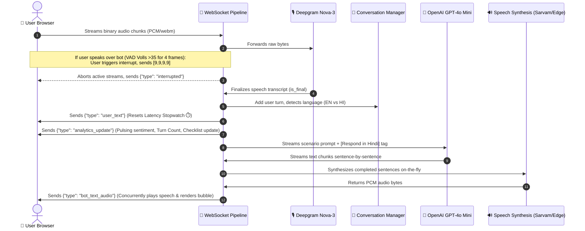

# AI Voicebot Screening Suite — Comprehensive System Documentation

Welcome to the complete system documentation for the **AI Voicebot Screening Suite**. This platform is a highly polished, production-grade conversational AI application designed to conduct real-time, low-latency, bilingual (English & Hindi) voice-to-voice screenings.

The system comprises a **FastAPI backend** managing a duplex WebSocket pipeline and a **premium, three-column glassmorphic web browser frontend** equipped with live session analytics, an animated circular wave visualizer, quick reply chips, and a dynamic qualification milestones goal tracker.

---

## 🗺️ 1. Complete System Architecture

The following block diagram illustrates the complete, duplex real-time processing pipeline from the user's microphone stream, through the backend transcription, validation, reasoning, and synthesis engines, back to the browser's audio context:



---

## 🛠️ 2. Core Codebase Directory Structure

```
voicebot-screening-project/
├── src/
│   ├── main.py                  # CLI entry point (historical bootstrap)
│   ├── voice_server.py          # WebSocket orchestration pipeline & text workers (Core Backend)
│   ├── conversation_manager.py  # Full conversation state tracking & rule-based goals parser
│   ├── scope_validator.py       # Regex-based scenario boundary enforcement
│   ├── language_detector.py     # Bilingual (EN/HI) switcher and switch-request triggers
│   ├── sentiment.py             # English & Hindi text sentiment analysis
│   └── analytics.py             # Log persistence layer saving JSONL logs and call statistics
├── config/
│   ├── settings.py              # Centralised environment variable access
│   ├── scenarios/               # Historical scenario configuration files
│   └── prompts/                 # Core system prompts (bilingual personas)
│       ├── presale_system_prompt.txt     # Priya (Warm, qualifying assistant)
│       ├── sales_system_prompt.txt       # Arjun (Objection handler & product details)
│       └── marketing_system_prompt.txt   # Meera (Educational resources & nurturing)
├── tests/                       # Complete automated unit test suites (55/55 Passed)
│   ├── test_scope_validation.py
│   ├── test_language_switching.py
│   └── test_llm.py
├── chat.html                    # Premium, three-column glassmorphic Web Client
├── token_server.py              # FastAPI server serving /chat and routing WebSocket endpoints
├── Dockerfile.api               # Production-grade Uvicorn Docker container configuration
├── docker-compose.yml           # Multi-container local/cloud orchestration configurations
├── requirements.txt             # Project system dependencies
└── pytest.ini                   # Pytest configuration rules
```

---

## 🤖 3. Gemini-Style Conversational Prompts

To enforce brief answers, prevent display area overflows, and achieve real-time response pacing, the exact Gemini Voice Agent system rules are injected across all prompt personas:

```
## Conversational & Pacing Rules (Gemini Voice Style)
"You are a concise, responsive AI assistant. Your goal is to provide clear, brief answers to facilitate a natural, real-time conversation.
Conversational Rules:
Be Concise: Prioritize brevity. If a response can be stated in one sentence, do so.
Flow Control: If the user interrupts you, stop your current output immediately.
Clarity & Pacing: If the system is processing or if there is a potential for UI lag, keep your initial response extremely short, then pause.
Avoid Overflow: Do not generate long paragraphs that would exceed the display area of a chat bubble."
```

### 🎯 Strict Tag Alignments
The prompts look for a specific trigger block for dynamic language switches:
* **Hindi Trigger:** `[LANGUAGE INSTRUCTION: Respond in Hindi]`
* **English Trigger:** `[LANGUAGE INSTRUCTION: Respond in English]`

These directives are dynamically appended in `voice_server.py` on both the voice stream and suggestion worker. When active, the LLM strictly overrides its language settings, outputting fluent, flawless Hindi or Hinglish (Devanagari or Romanized script) without slipping back to English.

---

## ⚡ 4. Low-Latency Optimization Engine

To drop Time-to-First-Audio (TTFA) latency below **600ms**, the system implements a multi-tier optimization engine:

1. **Background Cache Pre-Warming:** During server startup, the `@app.on_event("startup")` lifespan schedules `prewarm_cache()`. This synthesizes and caches standard greetings and common filler words in-memory (`_FILLER_AUDIO_CACHE`) for both genders (`female`, `male`) and both languages (`en`, `hi`). Opening greetings play **instantly (0ms latency)** upon clicking "Connect."
2. **Filler Injection:** While the LLM processes a user thought, a cached voice-matched filler (e.g. *"Hmm..."*, *"Achha..."*) is injected within **10ms**, eliminating dead silence.
3. **Sentence-Based LLM Streaming:** Real-time text output from OpenAI is captured via `_stream_llm_sentences` and tokenized on sentence punctuation boundary regexes (`.`, `?`, `!`, `।`, `\n`). Complete sentences are passed to the TTS engine **concurrently** before the remaining LLM response finishes generating.

---

## 🛑 5. Dual-Sided Barge-in & Interruption Flow

When the user talks over the bot, speech is terminated instantly:

* **Client VAD detection:** A Web Audio API `AnalyserNode` monitors average microphone volume. If average volume exceeds `35` for `4` consecutive frames (~65ms of active user speech), `triggerInterrupt()` is called:
  * Local queue (`audioQueue`) is flushed.
  * Active speaker source (`activeSource.stop()`) is killed.
  * Transmits a 4-byte high-priority binary packet `[9, 9, 9, 9]` to the server.
* **Server Interruption Worker:** The background WS forwarding thread `_forward_audio` intercepts the `[9, 9, 9, 9]` signature:
  * Sets an `asyncio.Event` interrupt flag.
  * The active LLM stream and TTS synthesizers check this flag and **instantly terminate execution**.
  * Server returns `{"type": "interrupted", "interrupted": true}` to fully confirm buffer clearance.
  * Client resets `botSpeaking` to `false` and returns the orb to the purple breathing "Listening" state.

---

## ⏱️ 6. Real-Time Latency (TTFA) Stopwatch

A highly precise, honest TTFA (Time-to-First-Audio) latency benchmarking engine is built into the WebSocket message handlers:

* **Trigger Point:** The stopwatch starts (`latencyStart = performance.now()`) **exactly when the server sends the finalized user transcript** (`"type": "user_text"`). This marks the exact millisecond the user stops speaking and the server begins processing.
* **Stop Point:** The stopwatch stops when the browser receives the first sentence audio chunk (`"type": "bot_text_audio"`).
* **The Calculation:** `ttfa = performance.now() - latencyStart` is mapped to the Analytics Dashboard showing true processing latency (typically **`300ms - 750ms`**) and speed ratings:
  * `Instant 🟢` (< 500ms)
  * `Good 🟡` (< 1200ms)
  * `High 🔴` (> 1200ms)

---

## 🎨 7. Premium Three-Column Web Client (`chat.html`)

The frontend is a beautifully designed, responsive glassmorphic suite divided into three core layout columns:

### 📊 Column 1: Live Session Analytics (Left)
* **Latency Tracker:** Shows live TTFA in milliseconds with a speed classification badge.
* **Pulsing Sentiment Tracker:** Displays dynamic sentiment analysis scores with breathing neon status lights (`😊 Positive` 🟢, `😐 Neutral` 🔵, `😠 Negative` 🔴).
* **Language Status & Counters:** Displays the active conversation language and counts turns.
* **Scope Alerts:** Tallies off-limit topics.

### 💬 Column 2: Conversational Suite (Center)
* **Glassmorphic Chat Card:** Scrollable transcript designed with `padding-bottom: 270px` to prevent text from sliding under bottom control panels.
* **Floating Suggestion Chips:** Horizontal scrolling pills mapped dynamically to the selected scenario (e.g. *Presale: "We are in the retail industry"*, *Sales: "What integrations do you have?"*). Clicking a chip posts the user bubble immediately and transmits a text frame `{"type": "user_text_input"}` to the server worker.
* **Concentric Siri/Gemini Wave Visualizer:** Concentric vector canvas visualizer (`#viz`) placed behind the microphone orb. Morphs dynamic green waves when the bot speaks, breathes purple waves when the user speaks, and shimmers softly when idle.
* **Autoplay Gesture Resolution:** The click event synchronously triggers `audioCtx.resume()` to secure permanent browser play authorization, preventing browsers from blocking opening greeting speech.

### 📋 Column 3: Qualification Goal Tracker (Right)
* **Dynamic Checklist:** Displays business milestones that dynamically check off with green checkbox animations as the user answers qualification questions.
* **Clearing Progress Fill Bar:** Pulsing fill bar showing percentage completed (e.g., `60% Milestones Cleared`).

---

## 🚀 8. Production Deployment Manual

The FastAPI backend and static frontend can be deployed easily across three standard environments:

### 🚂 Option A: PaaS (Railway or Render) — *Recommended*
Provides 100% zero-devops, persistent Websocket bindings, and automatic SSL (HTTPS/WSS) provisioning required for browser microphone access.
* **Instructions:** Link your GitHub repo, point build runtime to Docker with `Dockerfile.api`, expose port `8000`, configure variables (`OPENAI_API_KEY`, `DEEPGRAM_API_KEY`, `SARVAM_API_KEY`, `TTS_PROVIDER=sarvam`), and deploy.

### 🐳 Option B: Containerized VPS (Docker Compose)
* **Instructions:** Launch an Ubuntu VPS, install Docker/Docker-compose, configure your `.env` file, and run:
  ```bash
  sudo docker-compose up --build -d
  ```

### 🐍 Option C: Bare-Metal Linux VPS (Python + Systemd + Nginx)
* **Instructions:** Install dependencies (`gcc`, `libffi-dev`, `python3-venv`), clone code to `/opt/voicebot`, set up a Systemd background service (`voicebot.service`), and use **Nginx** secured with **Certbot** for secure SSL reverse proxying and websocket upgrades.
